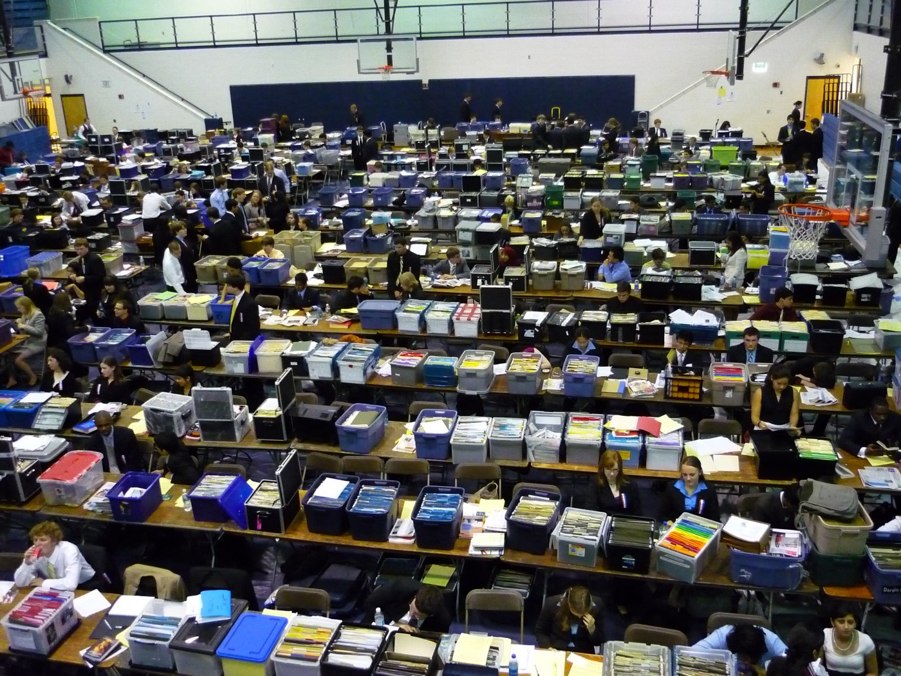

My sophomore year of college, I co-founded the Duke Speech team with a buddy of mine. Speech and debate was such an integral part of my high school experience, and I still wanted to compete. So, after mounds of administrative paperwork, my friend and I finally had made our dream come true — Duke’s very own competitive speaking team.

The structure of the college circuit is quite different from HS. First off, there is no traditional debate like Public Forum or Lincoln-Douglas. Well, there’s a modified Lincoln-Douglas that is actually more policy-oriented, but it’s still not traditional. Students mainly debate in [International Parliamentary Debate Association rules](http://www.ipdadebate.info/).

In terms of speech, there are some events from HS like Original Oratory, Extemporaneous Speaking, and Dramatic Interpretation; the college circuit also created some [new ones](https://sites.google.com/site/afanietnew2/products-services/event-descriptions) like After-Dinner Speaking and Communication Analysis. There are typically only 2 preliminary rounds, and then students break straight to finals (at least at small to mid-size tournaments, this is the case).

In February 2019, 6 members of our team made the trip to Baton Rouge, Louisiana to compete at the [Mardi Gras Alumni Invitational](https://www.collegeforensics.org/tournament/2019-mardi-gras-alumni-swing-tournament-pt-1) at LSU. I compete in Extemporaneous Speaking, where students are given 30 minutes to prepare a 7 minute speech based on a question. When I was in high school, students could **not** use the internet and students had to **completely memorize** the speech. When preparing speeches, students can use any offline resources; most teams made use of [DropBox](https://www.dropbox.com/), [Prepd](https://prepd.in/), or physical articles.

However, there have been some major rule changes:

1. Students can now use the internet when preparing their speeches.

1. Students can read from one 3" x 5" note card during the speech.

Let’s talk about these.

## The use of internet

It’s worth noting that the high school speech and debate governing body, the [National Speech and Debate Association](https://www.speechanddebate.org/), is also piloting this rule change as of last year.

In my opinion, part of the intellectual challenge of Extemp comes from having to stay up to date with current events. Students who challenged themselves to read the news every day and form their own viewpoints would perform better in the 30-minute time crunch because they had already shaped a unique perspective on the state of affairs.

With internet available, part of this intellectual challenge is lost. Students have the whole world of news at their fingertips thanks to Google, which really evens the playing field. Personally, I think we have lost a core value of Extemp here (and speech and debate in general), which is to make ourselves more involved citizens of the world.

As a counter-argument to myself, I understand why both the NSDA and the [American Forensic Association](https://www.americanforensicsassoc.org/) created this rule. Previously, larger teams could usually fare better with DropBox or Prepd-based solutions because they had more manpower to save articles. Small teams would suffer, because they simply could not save enough information. Maybe we need to find a middle ground.

## The use of note cards

I don’t believe there’s a counter-argument to my idea that we should get rid of this rule altogether. Again, part of the draw of Extemp is the intellectual challenge that comes behind having to memorize a handful of source material in such a short time-frame. The note card completely eliminates this draw, at least for me.

In my opinion, every student, whether in high school or college, should experience speech and debate for at least one year. If not for the incredible community and amazing friends you will meet along the way, do it for the intellectual engagement that’s difficult to find anywhere else.

Where I coach Extemp, at [Durham Academy](http://www.dadebate.com/), we still encourage our students to do research and save articles *even though* they can still use internet at tournaments. We believe it makes them more well-rounded as competitors. If all coaches took this same path (which I encourage them to take), we could continue to emphasize one of the core values of Extemp: to make ourselves more well-rounded citizens of the world.
